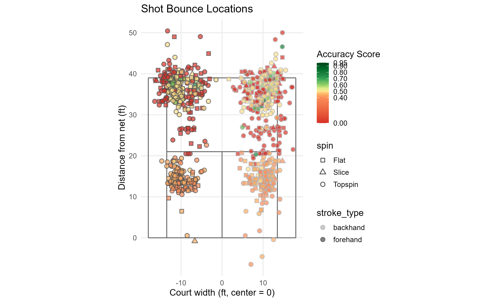

## The one-liner

> I combined **SwingVision ball-tracking data** with a **manually reviewed,
> weighted target-zone scoring system** so that **Willamette Men's Tennis
> players and coaches** can move past binary "in/out" statistics and see
> which factors actually predict shot precision.

**Role:** Solo, data collection design, IRB/consent process, data
engineering, statistical analysis, and machine learning.
**Team:** Solo project.
**Repo:** [github.com/lcasano26/data510-Luca-Capstone](https://github.com/lcasano26/data510-Luca-Capstone)

## The question

Collegiate tennis players often adjust technique and strategy based on
intuition rather than data, especially where coaching resources are
limited. Automated tracking tools like SwingVision generate a lot of raw
shot data, but reduce every shot to simple in/out outcomes that hide real
differences in precision. This project asks: **to what extent do stroke
type, accumulated fatigue, player skill (UTR), and handedness predict
cross-court groundstroke accuracy**, when accuracy is measured with a
weighted target-zone system instead of a binary outcome?

## The data

I collected 1,076 shots across five hitting sessions (one per participant,
UTR ranging 1.5-12.0), using a ball machine to standardize incoming feeds
and SwingVision to automatically track stroke type, speed, spin, and bounce
location. Every shot was then manually reviewed and assigned one of sixteen
accuracy zones, weighted from 0.00 (a miss) to 0.95 (closest to target).

The hardest part wasn't collecting the data, it was **trusting it**.
Cleaning turned up mislabeled export columns, bounce coordinates that
disagreed with the manually scored zone on ~38% of shots, and one shot
recorded 6 feet past the physical baseline (likely a tracking failure on a
high-arcing ball). I ended up treating the manually reviewed accuracy zone
as ground truth throughout, and using the automated coordinates only for
illustrative spatial visualization, a real, documented reliability
hierarchy rather than assuming the automated pipeline was correct by
default.

## The approach

Two tracks, deliberately kept separate:

- **Statistical testing (R):** a t-test and one-way ANOVA on each predictor
  individually, then a two-way ANOVA testing stroke type, fatigue stage,
  and their interaction *together*, because that's what the research
  question actually asks.
- **Machine learning (Python):** six regression approaches (Linear
  Regression, KNN, SVR, Random Forest, Gradient Boosting, XGBoost)
  compared under identical conditions, evaluated with
  **leave-one-session-out cross-validation**, each fold holds out one
  player's *entire* session, not a random slice of shots, since shots from
  the same player aren't independent observations.

## Findings

{fig-alt="Scatter plot of tennis shot bounce locations colored by accuracy score" width="90%"}

The headline result isn't a clean confirmation, it's a finding about the
**experimental design itself**. Individually, stroke type and fatigue stage
each showed a small, statistically significant effect on accuracy. But
because each session was collected in a strictly blocked order (~100
forehands, then backhands, rather than alternating), stroke type and
fatigue turned out to be almost the same variable (r = -0.94). Once tested
together in a two-way ANOVA, **neither effect survived**, a textbook
confound, not a contradiction.

On the machine learning side, no model beat the R² > 0 threshold set in my
original proposal, but every tuned model (including a shallow, regularized
Random Forest that won out over more complex options) did beat a naive
baseline. Player skill (UTR) dominated feature importance at 66-72%,
far ahead of anything related to stroke type or fatigue.

**The honest caveat:** this dataset can't tell you whether stroke type or
fatigue independently drives accuracy, because they were never varied
independently during collection. That's the single biggest thing I'd change
about the study design, and it's the main recommendation in my future work.

## The full write-up

<a href="projects/capstone/Capstone Write-Up.pdf" class="btn btn-primary" target="_blank">Download the Write Up (PDF)</a>

<iframe src = "projects/capstone/Capstone Write-Up.pdf" width = "100%" height= "800px"
  style = "border: 1px solid #ddd; "></iframe>

## Poster

<a href="projects/capstone/poster.pdf" class="btn btn-primary" target="_blank">Download the poster (PDF)</a>

<iframe src="projects/capstone/poster.pdf" width="100%" height="800px"
  style="border: 1px solid #ddd;"></iframe>

## Dig deeper

- 📦 **Code & pipeline:** [data510-Luca-Capstone](https://github.com/lcasano26/data510-Luca-Capstone)
- 📊 **Poster:** embedded above
